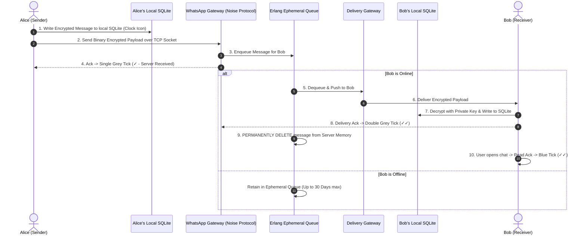
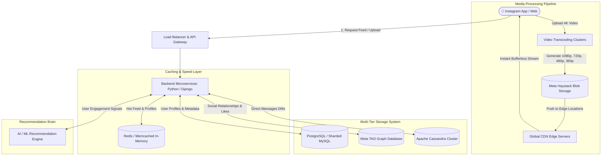

# 🏗️ WhatsApp vs Instagram: Deep Dive System Architecture Guide

> **A Comprehensive Engineering Breakdown of Client-Centric (WhatsApp) vs Cloud-Centric (Instagram) Architecture, Databases, Network Protocols, and Media Pipelines.**

---

## 📑 Table of Contents
1. [Executive Summary & Core Philosophy](#1-executive-summary--core-philosophy)
2. [Side-by-Side Comparison Matrix](#2-side-by-side-comparison-matrix)
3. [Deep Dive: WhatsApp Architecture](#3-deep-dive-whatsapp-architecture)
   - [3.1 Local Storage Layer (SQLite)](#31-local-storage-layer-sqlite)
   - [3.2 Real-time Connection Protocol (Noise / WebSockets)](#32-real-time-connection-protocol-noise--websockets)
   - [3.3 Backend Server & Ephemeral Queue Engine (Erlang)](#33-backend-server--ephemeral-queue-engine-erlang)
   - [3.4 End-to-End Encryption (Signal Protocol)](#34-end-to-end-encryption-signal-protocol)
   - [3.5 Message Delivery Lifecycle Diagram](#35-message-delivery-lifecycle-diagram)
4. [Deep Dive: Instagram Architecture](#4-deep-dive-instagram-architecture)
   - [4.1 Backend Engine & API Layer (Python/Django & GraphQL)](#41-backend-engine--api-layer-pythondjango--graphql)
   - [4.2 Multi-Tier Database Architecture](#42-multi-tier-database-architecture)
   - [4.3 In-Memory Caching Strategy (Redis & Memcached)](#43-in-memory-caching-strategy-redis--memcached)
   - [4.4 Media Encoding & Global CDN Pipeline (Reels / Stories)](#44-media-encoding--global-cdn-pipeline-reels--stories)
   - [4.5 AI Recommendation & Feed Ranking Engine](#45-ai-recommendation--feed-ranking-engine)
   - [4.6 Reel Upload & Stream Flow Diagram](#46-reel-upload--stream-flow-diagram)
5. [Key Takeaways for Developers & System Architects](#5-key-takeaways-for-developers--system-architects)

---

## 1. Executive Summary & Core Philosophy

| Platform | Architectural Philosophy | Primary Data Residence | Privacy Model |
| :--- | :--- | :--- | :--- |
| **WhatsApp** | **Client-Centric & Ephemeral**<br>Server acts as a secure transit broker / postman. Data lives on the user's phone. | **User Device (Local SQLite)** | End-to-End Encrypted (Zero-Knowledge Server) |
| **Instagram** | **Cloud-Centric & Social Graph**<br>Server acts as a persistent global content store, distributor, and intelligence engine. | **Meta Cloud Data Centers** | Server-Managed Access & Cloud Hosted |

---

## 2. Side-by-Side Comparison Matrix

```
+---------------------+-----------------------------------+-----------------------------------+
| Component / Feature |             WHATSAPP              |             INSTAGRAM             |
+---------------------+-----------------------------------+-----------------------------------+
| Primary Database    | Local SQLite (Phone Storage)      | PostgreSQL / Sharded MySQL (Cloud)|
| Social Graph DB     | N/A (Contacts derived locally)   | Meta TAO (Distributed Graph DB)   |
| Messaging Store     | Ephemeral Queue (Mnesia/RocksDB)  | Apache Cassandra (Persistent DMs) |
| Primary Backend     | Erlang / Elixir (Concurrency)     | Python / Django + C++ Services    |
| API / Protocol      | Noise Protocol / XMPP / WebSockets| GraphQL + REST APIs               |
| Media Storage       | Temporary Blob / User Device      | Meta Haystack / F4 Storage Engine |
| Content Delivery    | Direct P2P / Relayed CDN Buffers  | Worldwide Edge CDN Caching        |
| Caching Layer       | Local App SQLite Cache / LevelDB  | Redis & Memcached In-Memory Cache |
| Offline Capability  | 100% Full Local Read/Write Access | Limited Cache Read Only           |
+---------------------+-----------------------------------+-----------------------------------+
```

---

## 3. Deep Dive: WhatsApp Architecture



### 3.1 Local Storage Layer (SQLite)
- **Path on Android:** `/data/data/com.whatsapp/databases/msgstore.db.crypt14`
- **Mechanism:**
  - WhatsApp creates an embedded **SQLite relational database** inside the application's private sandboxed directory.
  - All messages, metadata, status indicators, and contact indexes are stored locally.
  - The database is encrypted at rest using AES-256 with a unique user key.
- **Benefits:**
  - Instant search and instant message opening even in airplane mode.
  - Zero cloud server storage costs for storing billions of historical messages.

### 3.2 Real-time Connection Protocol (Noise / WebSockets)
- Mobile apps maintain a **persistent, long-lived TCP connection** using Meta’s optimized implementation of the **Noise Protocol Framework**.
- Features:
  - Ultra-low latency connection handshakes (< 50ms).
  - Encrypted binary frames (replacing verbose XML/JSON formats for maximum battery and data efficiency).
  - Automatic reconnection logic when switching between Wi-Fi and Cellular networks.

### 3.3 Backend Server & Ephemeral Queue Engine (Erlang)
- WhatsApp uses **Erlang/OTP** running on FreeBSD/Linux:
  - Erlang's lightweight actor model allows a single server node to maintain over **2 to 3 million concurrent persistent socket connections**.
- **Ephemeral Message Queuing:**
  - Messages exist on the server memory (using **Mnesia** and **RocksDB**) **ONLY** until the recipient device acknowledges delivery (`ACK`).
  - As soon as Bob’s device sends back the receipt, the server discards the message payload forever.

### 3.4 End-to-End Encryption (Signal Protocol)
- **Double Ratchet Algorithm & Curve25519:**
  - Every message has its own ephemeral cryptographic key.
  - Public keys are stored on the server directory; private keys **never leave the user’s device**.
  - Even if WhatsApp’s servers are intercepted, the ciphertext cannot be decoded by any third party.

---

## 4. Deep Dive: Instagram Architecture



### 4.1 Backend Engine & API Layer (Python/Django & GraphQL)
- Instagram operates one of the **largest Python/Django deployments in the world**.
- **GraphQL APIs:**
  - Instead of fetching bloated REST payloads, the mobile app requests precisely the fields needed (e.g., username, avatar_url, like_count, media_url).
  - Minimizes payload overhead and optimizes bandwidth consumption.

### 4.2 Multi-Tier Database Architecture

#### A. Relational Data: Sharded MySQL / PostgreSQL
- Handles user accounts, credentials, post metadata, caption texts, and comment records.
- Horizontally sharded across thousands of database nodes using consistent hashing algorithms.

#### B. Social Graph Data: Meta TAO (The Associations and Objects)
- Specifically designed to represent and query social graph structures:
  - **Objects:** Users, Posts, Reels, Stories, Comments.
  - **Associations:** `User -> Follows -> User`, `User -> Liked -> Post`, `User -> TaggedIn -> Photo`.
- Provides sub-millisecond graph traversals for queries like *"Show mutual friends who liked this Reel"*.

#### C. High-Throughput Messaging: Apache Cassandra
- Powers Instagram Direct Messages (DMs).
- Columnar, decentralized NoSQL architecture engineered for massive write throughput without single points of failure.

### 4.3 In-Memory Caching Strategy (Redis & Memcached)
- Millions of users query the same popular celebrity profiles and viral posts simultaneously.
- Direct database hits would cause database overload.
- **Cache-Aside Pattern:**
  - Hot posts, trending reels, and session tokens are cached directly in RAM (Redis / Memcached).
  - Cache hits resolve in **< 2 milliseconds**.

### 4.4 Media Encoding & Global CDN Pipeline (Reels / Stories)
1. **Ingestion:** User uploads a high-resolution video.
2. **Adaptive Bitrate Transcoding:** The video cluster splits the video into multiple resolutions (1080p, 720p, 480p, 360p) using H.264 / H.265 / AV1 codecs.
3. **Chunking:** The video is segmented into 2-second segments (HLS / MPEG-DASH).
4. **Edge CDN Distribution:** Segments are distributed to Edge CDN caches geographically closest to users (e.g., Mumbai, Delhi, Frankfurt, Singapore).
5. **Instant Playback:** When a user scrolls to the next Reel, the first 2 seconds are already pre-buffered, resulting in **zero playback delay**.

### 4.5 AI Recommendation & Feed Ranking Engine
- Evaluates billions of candidate items in real time based on:
  - **Watch Time & Completion Rate:** Did the user watch 90% of the video?
  - **Engagement Affinity:** Did the user share, like, or check the audio track?
  - **Content Vector Embeddings:** Deep neural networks analyze video frames and audio to match with user preference vectors.

---

## 5. Key Takeaways for Developers & System Architects

```
+------------------------------------------------------------------------------------------------+
|                                    ARCHITECTURAL LESSONS                                       |
+------------------------------------------------------------------------------------------------+
| 1. Don't Connect Mobile Apps Directly to Databases:                                            |
|    Never expose database credentials in client code. Always use an API Gateway, WebSockets,    |
|    or Backend Microservices layer.                                                             |
|                                                                                                |
| 2. Choose Storage Strategy Based on Product Goals:                                             |
|    - If Privacy & Offline Speed are top priorities -> Client-Centric Local SQLite (WhatsApp).  |
|    - If Discoverability & Cross-Device Sync are top priorities -> Cloud-Centric CDN (Instagram)|
|                                                                                                |
| 3. Caching & CDNs Are Mandatory for Scale:                                                     |
|    Dynamic database queries must be protected behind Redis RAM caches and Global Edge CDNs.   |
|                                                                                                |
| 4. Security & Ephemeral Pipelines:                                                             |
|    Deleting delivered message packets instantly reduces server liability and infrastructure   |
|    costs by up to 90%.                                                                         |
+------------------------------------------------------------------------------------------------+
```

---
*Created for Notybook System Architecture Documentation & Reference.*
